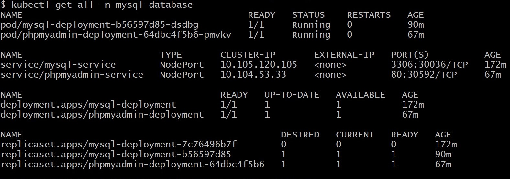
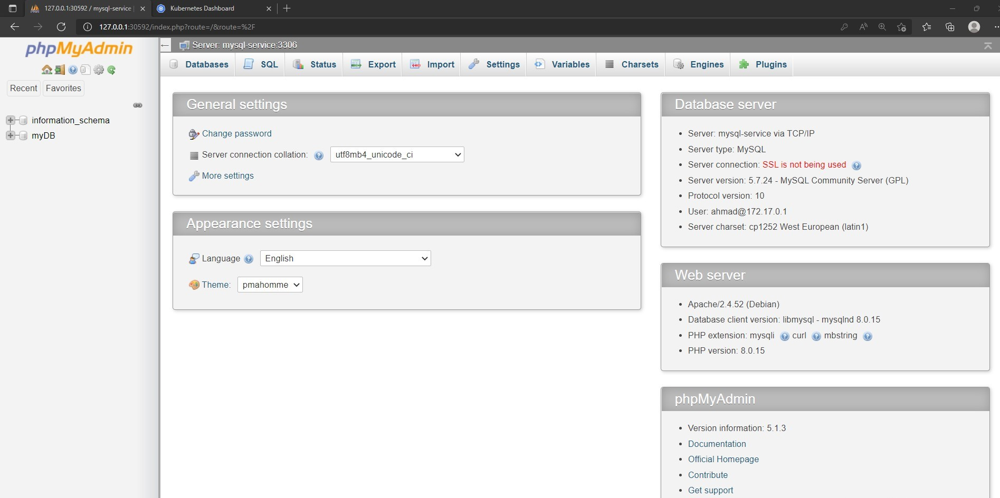

# MySQL-and-PhpMyAdmin-on-Kubernetes


[![LinkedIn][linkedin-shield]][linkedin-url]
[![Twitter][twitter-shield]][twittwe-url]
[![Twitter][github-shield]][github-url]


<!-- PROJECT LOGO -->
<p align="center">

  <h3 align="center"> Deploy MySQL and PhpMyAdmin by using Kubernetes </h3>


  <p align="center">
This yml files will setup a MySQL and PhpMyAdmin using Kubernetes
  </p>
  
# Steps
### 1. Clone the repo

Clone the `MySQL-and-PhpMyAdmin-on-Kubernetes` locally. In a terminal, run:

```
git clone https://github.com/Ahmad-Faqehi/MySQL-and-PhpMyAdmin-on-Kubernetes.git
```

### 2. Create namespace for this project
This project will be work in custome namespace, to create namespace run:

```shell
kubectl create namespace mysql-database
```
### 3. Create the deployments and services

Either run this commands listed in it:

```shell
kubectl apply -f mysql-secret.yaml -n mysql-database
kubectl apply -f mysqldb.yaml -n mysql-database
kubectl apply -f phpmyadmin.yaml -n mysql-database
```

### 4. Access The database throw PhpMyAdmin

After deploying, we need to be sure that pods are running. Check on the status via:

```shell
kubectl get all -n mysql-database
```

Once all pod are running we need to know the IP address of our phpmyadmin.
* []() All running <br>


<Br/>
open your localhost ip with port 30592

```shell
http://localhost:30592
```

Notes: if you using minikube run this command to access the application:

```shell
minikube service phpmyadmin-service -n mysql-database
```


<!-- USAGE EXAMPLES -->
## Screenshots


* []() Login Page of PhpMyAdmin <br>


the credentials for login is
```shell
Username: ahmad
Password: password
```

The Home Page



<!-- CONTACT -->
## Contact Me

Ahmad Faqehi - [iAhmad.info](https://iAhmad.info) - alfaqehi775@hotmail.com

Project Link: [https://github.com/Ahmad-Faqehi/MySQL-and-PhpMyAdmin-on-Kubernetes](https://github.com/Ahmad-Faqehi/MySQL-and-PhpMyAdmin-on-Kubernetes)


<!-- MARKDOWN LINKS & IMAGES -->
<!-- https://www.markdownguide.org/basic-syntax/#reference-style-links -->
[linkedin-shield]: https://img.shields.io/badge/-LinkedIn-black.svg?style=for-the-badge&logo=linkedin&colorB=555
[linkedin-url]: https://linkedin.com/in/ahmad-faqehi
[twitter-shield]: https://img.shields.io/badge/-twitter-black.svg?style=for-the-badge&logo=twitter&colorB=555
[twittwe-url]: https://twitter.com/A_F775
[github-shield]: https://img.shields.io/badge/-github-black.svg?style=for-the-badge&logo=github&colorB=555
[github-url]: https://github.com/Ahmad-Faqehi